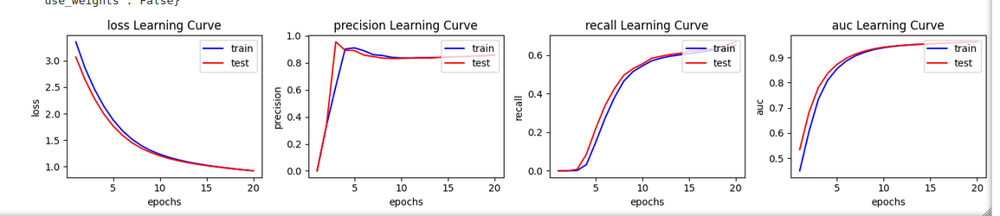
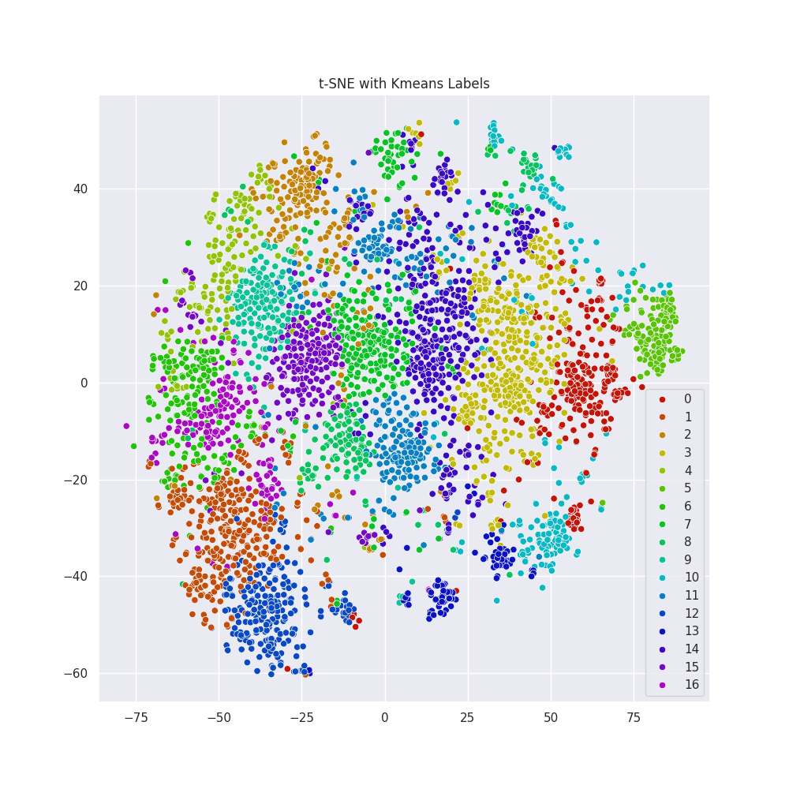
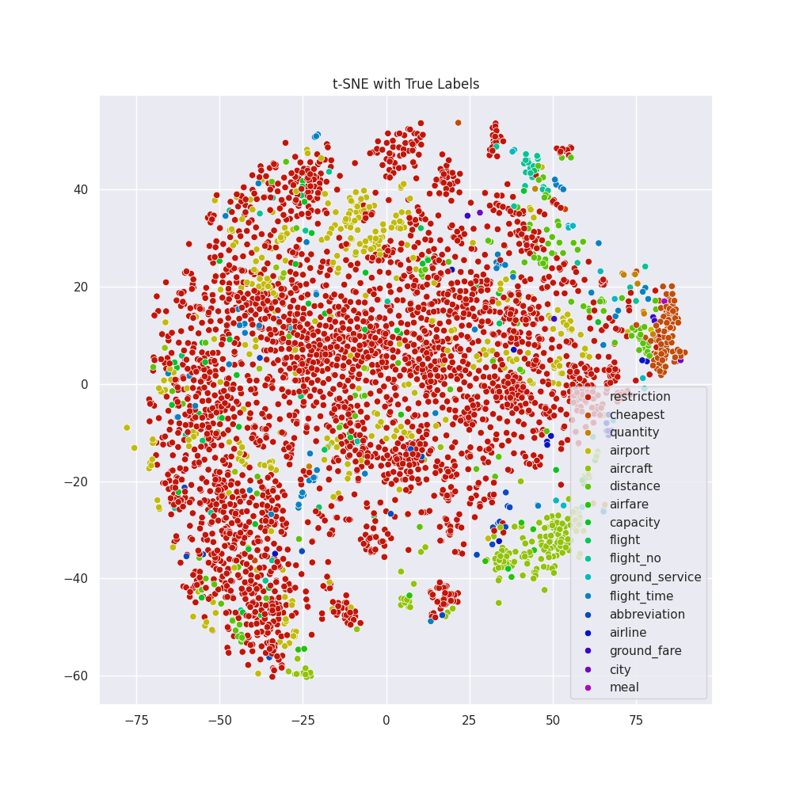

## Scope

This is a text classifier of the atis intent dataset:

see

This is a repo demonstrates my coding practices that I use every day at my work.


## How you can run things

From within the top repo directory run:
 ```bash
   make get_embedings
 ```
 If this fails don't worry there are buck up light weight embedings

 In order to train a model and serve it you need to do:

 ```bash
 make setup
 poetry shell
 ``` 
 Followed by:

 ```bash
 python app/train_model.py --replace-principal --epochs 20 
 uvicorn app.api.api:app --host localhost --port 8080 
 ```
 You can also use docker but it will take too long to build the images. Since this is demo / dev repo
 it has a lot of heavy depndencies. Normally you build lighter dedicated iamges. If you still want to try it just type:

 ```bash
 make train
 make run
 ```
The make file will handle the docker compose manifest file commands.

To try the api you could either navigate to
```bash
http://localhost:8080/docs
```
or in shell type

```bash

curl -X 'POST' \
  'http://localhost:8080/api/intent' \
  -H 'accept: application/json' \
  -H 'Content-Type: application/json' \
  -d '{
  "text": "What is the ultimate intent of life"
}'
```
If you would like to see tensorboard (only applicable with keras components for now)first run the following:
```bash
python app/runners/train_model_runner.py --replace-principal --epochs 20 --use-tensorboard
tensorboard --logdir=storage/tensorboard/train
tensorboard --logdir=storage/tensorboard/validation
```

Lastly you will find a notebook in the follwoing path:
```bash
notebooks/compare-experiments.ipynb
```
You can run the jupyter server as:
```bash
poetry run jupyter notebook
```


If you want to prepare a set of different configuratons run them and check the learning curves you can first go to the 
```app/epxeriment_runner.py``` file and add your configurations there. It is straignforward. For a list of possible configurations you can check the configuration class in ```app/conf.py```. After seting up the experiments you can run:

```bash
python app/runners/experiment_runner.py  --epochs 20 --pool-size <number of threads>
```

and whatch the logs running. Once finished you can go to jupiter and do the following:
 - Execute all the cell from the top up to and including the cell titled as ```Past experiment runs```
 - You will get a list of experiments ordered in time.
 - In your case you will probably have only one.
 - Note the index of the folder/experiment that you want to check
 - Now go to the cell titled as ```Compare two models in an experiments```, set the __eid__ that you noted from above and run the cell. 
 - Only two possible configurations per experiment can be shown at a time for now from the plotting function. 


### Evaluation metrics

#### Offline
I include standard learning curves of the metrics. In order to visualize them you can run a model as descrivbed above (dont forget to use the `--replace-principal` toggle), you can tehn go in the note book and evaluate the cell title as: ```Train and Test learning for the Principal Model```.


Here is what you should see:




It seems that the model is learning OK. 


I also wanted to include _Cohen's kappa coefficient_ but it is not possible for multiclasses where the labels are multihot encoded. So I decided to not change this as it will cost too much time. I like thi metric because it is as good as f1-score but less forgiving.


### Exploring the embedings space
I wanted to explore the representation of the queries on the embedings space. For the query embeding I am adding the word embedings as vectors. Probably a very naive assumption.. I assumed that quaries that are labeled the same have their endpoint close in the embeded space. I also did a keans clustering to see if there is any structure in the manifold regardless of how we label the data externally. You can find the code in the juputer notebook. Here is how it looks like.



There are some clear clusters that the k means could find The question how do they compare to the true labels 



Here we see the majority of the labels are actually fliaght They are so many that they practivcally do not much information. The interasteing categories are the abbreviationand ground_service for which Kmeans also seem to have foudn structure in this area

It would be interasted to see what the model predicts as well....

